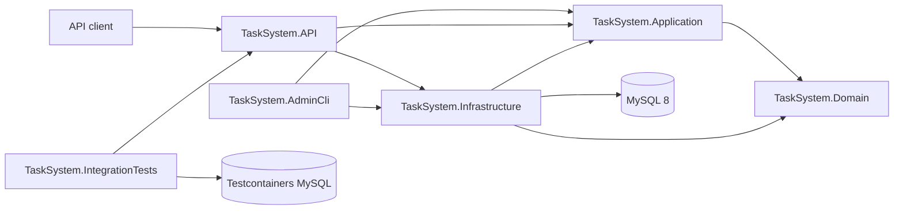
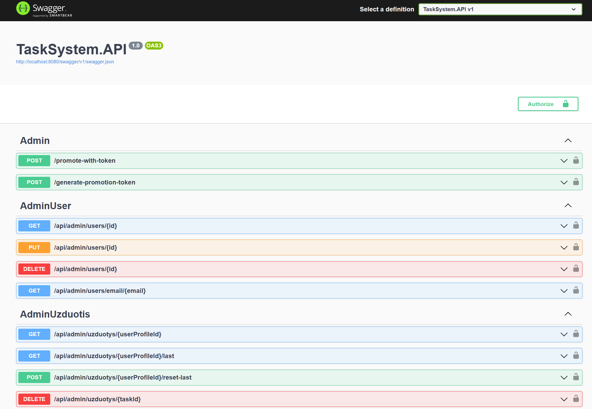

# TaskSystem

[](https://github.com/AurimasG1/TaskSystem/actions/workflows/ci.yml)

TaskSystem is a task management REST API built with ASP.NET Core, Entity Framework Core, and MySQL.

It is a portfolio backend project focused on layered architecture, authentication and authorization, refresh-token security, automated testing with real infrastructure, Docker-based development, and continuous integration.

## Highlights

- Layered monolith with separate API, Application, Domain, and Infrastructure projects
- JWT access-token authentication
- Persisted refresh-token rotation and revoked-token rejection
- `onboarding`, `user`, and `admin` authorization roles
- Resource ownership checks for user-scoped task operations
- Administrative user and task management
- Separate admin bootstrap/recovery CLI
- Active refresh-token revocation after admin promotion
- EF Core migrations with MySQL 8
- Unit tests with xUnit and Moq
- Integration tests using `WebApplicationFactory`, Testcontainers, and real MySQL
- Docker Compose environment for MySQL, migrations, and the API
- GitHub Actions pipeline for build, tests, migration checks, container build, and health verification

## Technology stack

| Area                | Technologies                                          |
| ------------------- | ----------------------------------------------------- |
| Backend             | C#, .NET 10, ASP.NET Core Web API                     |
| Persistence         | Entity Framework Core, Pomelo MySQL provider, MySQL 8 |
| Authentication      | JWT bearer authentication, refresh-token rotation     |
| Authorization       | Role-based and resource ownership authorization       |
| Validation          | FluentValidation                                      |
| Mapping             | Mapster                                               |
| API documentation   | Swagger / OpenAPI                                     |
| Unit testing        | xUnit, Moq                                            |
| Integration testing | `WebApplicationFactory`, Testcontainers, MySQL 8      |
| Infrastructure      | Docker, Docker Compose, health checks                 |
| CI                  | GitHub Actions                                        |

## Architecture



### Solution projects

| Project                       | Responsibility                                                                                              |
| ----------------------------- | ----------------------------------------------------------------------------------------------------------- |
| `TaskSystem.API`              | Controllers, authentication, authorization, Swagger, middleware, health checks, and dependency registration |
| `TaskSystem.Application`      | Commands, queries, handlers, DTOs, validation, mapping, and application use cases                           |
| `TaskSystem.Domain`           | Entities, value objects, domain behavior, roles, and repository abstractions                                |
| `TaskSystem.Infrastructure`   | EF Core, repositories, migrations, JWT services, background services, and persistence                       |
| `TaskSystem.AdminCli`         | Administrative bootstrap and recovery operations                                                            |
| `TaskSystem.Tests`            | Unit tests for application handlers and domain behavior                                                     |
| `TaskSystem.IntegrationTests` | API integration tests against a temporary real MySQL database                                               |

## Authentication flow

A new account starts with the `onboarding` role.

```text
Register account
      ↓
onboarding role
      ↓
Complete user profile
      ↓
user role
      ↓
Access token + persisted refresh token
```

Protected endpoints use the standard authorization header:

```http
Authorization: Bearer ACCESS_TOKEN
```

When a refresh token is exchanged:

1. The current refresh token is validated.
2. The current token is revoked.
3. A new access token is issued.
4. A new refresh token is generated and persisted.
5. Reusing the revoked token is rejected.

## Authorization model

| Role         | Purpose                                         |
| ------------ | ----------------------------------------------- |
| `onboarding` | Account exists, but profile setup is incomplete |
| `user`       | Standard authenticated application user         |
| `admin`      | Administrative access to users and tasks        |

Authorization is enforced through:

- role checks for onboarding and administrative endpoints;
- resource ownership checks for user-scoped tasks;
- JWT claims for authenticated user identity.

## Main capabilities

### Authentication and users

- Account registration
- Profile completion
- Login
- JWT access-token generation
- Refresh-token persistence and rotation
- Revoked-token rejection
- Background cleanup of expired and revoked tokens

### Task management

- Create, retrieve, update, and delete tasks
- Retrieve and reset the latest task
- Restrict normal users to their own resources
- Administrative task access

### Administration

- Administrative user management
- Administrative task management
- Token-based admin promotion flow
- Bootstrap/recovery promotion through a separate CLI
- Active refresh-token revocation after promotion

## API documentation

After starting the Docker environment:

- Swagger UI: `http://localhost:8080/swagger`
- Health check: `http://localhost:8080/health`

Swagger contains the current endpoint list, request schemas, and JWT authorization controls.



## Quick start with Docker

### Prerequisites

- Git
- Docker Desktop

Clone the repository:

```bash
git clone https://github.com/AurimasG1/TaskSystem.git
cd TaskSystem
```

Create the local environment file:

```bash
cp .env.example .env
```

Replace the example database credentials and JWT key in `.env`.

Start MySQL, apply migrations, and launch the API:

```bash
docker compose up -d --build
```

Check the containers:

```bash
docker compose ps -a
```

Expected state:

- MySQL is healthy
- the migration container completed successfully
- the API is running

Stop the environment:

```bash
docker compose down
```

To also delete the local MySQL volume:

```bash
docker compose down -v
```

> `docker compose down -v` permanently removes the local development database.

## Local development

### Prerequisites

- .NET 10 SDK
- Docker Desktop or a local MySQL 8 instance
- Git

Restore dependencies and repository-local .NET tools:

```bash
dotnet tool restore
dotnet restore TaskSystem.slnx
```

Start only MySQL through Docker:

```bash
cp .env.example .env
docker compose up -d mysql
```

Configure API secrets:

```bash
dotnet user-secrets set   "ConnectionStrings:DefaultConnection"   "server=127.0.0.1;port=3306;database=tasksystem;user=YOUR_USER;password=YOUR_PASSWORD"   --project TaskSystem.API

dotnet user-secrets set   "Jwt:Key"   "REPLACE_WITH_A_LONG_RANDOM_SECRET"   --project TaskSystem.API

dotnet user-secrets set   "Jwt:Issuer"   "TaskSystemAPI"   --project TaskSystem.API
```

Apply migrations:

```bash
dotnet ef database update   --project TaskSystem.Infrastructure   --startup-project TaskSystem.API
```

Run the API:

```bash
dotnet run --project TaskSystem.API
```

## Admin bootstrap CLI

`TaskSystem.AdminCli` is intended for first-admin bootstrap and account-recovery scenarios. It is not the normal client-facing administration flow.

The CLI connects directly to the database and calls the application-level admin promotion use case.

Configure its connection string:

```bash
dotnet user-secrets set   "ConnectionStrings:DefaultConnection"   "server=127.0.0.1;port=3306;database=tasksystem;user=YOUR_USER;password=YOUR_PASSWORD"   --project TaskSystem.AdminCli
```

Show available commands:

```bash
dotnet run --project TaskSystem.AdminCli -- --help
```

Promote a user by email:

```bash
dotnet run --project TaskSystem.AdminCli --   bootstrap-admin   --email user@example.com
```

Promote a user by ID:

```bash
dotnet run --project TaskSystem.AdminCli --   bootstrap-admin   --user-id 1
```

A successful promotion changes the user's role to `admin` and revokes active refresh tokens.

## Testing

Docker must be running because integration tests start a temporary MySQL container through Testcontainers.

Run all tests:

```bash
dotnet test TaskSystem.slnx
```

Run unit tests:

```bash
dotnet test TaskSystem.Tests/TaskSystem.Tests.csproj
```

Run integration tests:

```bash
dotnet test TaskSystem.IntegrationTests/TaskSystem.IntegrationTests.csproj
```

The automated tests cover application handlers, repository interactions, authentication failures, refresh-token persistence and rotation, authorization boundaries, health checks, and resource ownership.

## Continuous integration

GitHub Actions runs on pushes and pull requests. The pipeline performs:

1. dependency and local-tool restore;
2. Release build;
3. unit and integration tests;
4. EF Core pending-model-change check;
5. Docker Compose configuration validation;
6. Docker image build;
7. full-stack startup;
8. API health smoke test;
9. container cleanup.

## Configuration and secrets

| Key                                   | Purpose                 |
| ------------------------------------- | ----------------------- |
| `ConnectionStrings:DefaultConnection` | MySQL connection string |
| `Jwt:Key`                             | JWT signing key         |
| `Jwt:Issuer`                          | JWT issuer              |

Environment-variable equivalents:

```text
ConnectionStrings__DefaultConnection
Jwt__Key
Jwt__Issuer
```

Local development secrets should be stored in .NET User Secrets or an ignored `.env` file. Real credentials must not be committed.

## Planned improvements

- Standardized API errors using `ProblemDetails`
- Integration test for revoked refresh-token rejection after admin promotion
- Admin role-change audit trail
- Rate limiting for authentication endpoints
- Pagination and filtering for administrative queries
- Code coverage reporting
- Cloud deployment configuration

## Author

**Aurimas Gedvilas**

- GitHub: [AurimasG1](https://github.com/AurimasG1)
- LinkedIn: [aurimas-gedvilas](https://www.linkedin.com/in/aurimas-gedvilas/)
