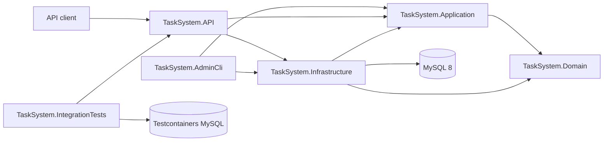

# TaskSystem

[](https://github.com/AurimasG1/TaskSystem/actions/workflows/ci.yml)

TaskSystem is a task management REST API built with ASP.NET Core, Entity Framework Core, and MySQL.

The project demonstrates layered backend architecture, JWT authentication with refresh token rotation, role- and resource-based authorization, automated testing with real infrastructure, Docker-based development, database migrations, and continuous integration.

## What this project demonstrates

- Layered separation between API, application use cases, domain models, and infrastructure
- JWT access tokens and persisted refresh-token rotation
- Reused and revoked refresh-token rejection
- `onboarding`, `user`, and `admin` authorization roles
- Ownership checks that prevent users from accessing another user's tasks
- Admin bootstrap/recovery through a separate CLI
- Refresh-token revocation when a user is promoted to administrator
- Entity Framework Core migrations and MySQL persistence
- Unit tests with xUnit and Moq
- Integration tests with `WebApplicationFactory`, Testcontainers, and real MySQL
- Docker Compose orchestration for MySQL, migrations, and the API
- GitHub Actions CI with build, tests, migration checks, container build, and health verification

## Technology stack

| Area | Technologies |
|---|---|
| Backend | C#, .NET 10, ASP.NET Core Web API |
| Persistence | Entity Framework Core, Pomelo MySQL provider, MySQL 8 |
| Authentication | JWT bearer authentication, refresh-token rotation |
| Authorization | Role-based and resource ownership authorization |
| Validation | FluentValidation |
| Mapping | Mapster |
| API documentation | Swagger / OpenAPI |
| Unit testing | xUnit, Moq |
| Integration testing | xUnit, `WebApplicationFactory`, Testcontainers, MySQL 8 |
| Infrastructure | Docker, Docker Compose, health checks |
| CI | GitHub Actions |

## Architecture



### Solution projects

| Project | Responsibility |
|---|---|
| `TaskSystem.API` | Controllers, authentication, authorization, Swagger, middleware, health checks, and dependency registration |
| `TaskSystem.Application` | Commands, queries, handlers, DTOs, validation, mapping, and application use cases |
| `TaskSystem.Domain` | Entities, value objects, domain behavior, and repository abstractions |
| `TaskSystem.Infrastructure` | EF Core, repositories, migrations, JWT services, background services, and persistence |
| `TaskSystem.AdminCli` | Administrative bootstrap and recovery operations |
| `TaskSystem.Tests` | Unit tests for handlers and domain behavior |
| `TaskSystem.IntegrationTests` | End-to-end API tests against a real temporary MySQL database |

## Authentication and onboarding

A new account starts with the `onboarding` role.

```text
Register account
      ↓
onboarding role
      ↓
Complete user profile
      ↓
user role
      ↓
Access token + persisted refresh token
```

Access tokens are sent through the standard HTTP header:

```http
Authorization: Bearer ACCESS_TOKEN
```

When a refresh token is exchanged:

1. The current refresh token is revoked.
2. A new access token is issued.
3. A new refresh token is generated and persisted.
4. Reusing the revoked token is rejected.

## Authorization model

| Role | Purpose |
|---|---|
| `onboarding` | Account exists, but profile setup is incomplete |
| `user` | Standard authenticated application user |
| `admin` | Administrative access to users and tasks |

Authorization is enforced at two levels:

- Role checks protect administrative and onboarding-specific endpoints.
- Ownership checks prevent users from reading or modifying another user's tasks.

## Main capabilities

### Authentication

- Account registration
- Profile completion
- Login
- JWT access-token generation
- Refresh-token persistence and rotation
- Revoked-token rejection
- Background cleanup of expired and revoked tokens

### Task management

- Create tasks
- Retrieve user-owned tasks
- Update tasks
- Delete tasks
- Retrieve or reset the latest task
- Administrative task access

### Administration

- Administrative user management
- Administrative task management
- Token-based admin promotion flow
- Separate bootstrap CLI for direct recovery operations
- Active refresh-token revocation after admin promotion

## API documentation

Swagger contains the current endpoint list, schemas, and authorization controls.

After starting the Docker environment:

- Swagger UI: `http://localhost:8080/swagger`
- Health check: `http://localhost:8080/health`


## Quick start with Docker

### Prerequisites

- Git
- Docker Desktop

Clone the repository:

```bash
git clone https://github.com/AurimasG1/TaskSystem.git
cd TaskSystem
```

Create the local environment file:

```bash
cp .env.example .env
```

Replace the example database passwords and JWT key in `.env`, then start the stack:

```bash
docker compose up --build
```

Docker Compose will:

1. Start MySQL 8.
2. Wait for the database health check.
3. Apply EF Core migrations.
4. Start the API.

Stop the environment:

```bash
docker compose down
```

To also delete the local MySQL volume:

```bash
docker compose down -v
```

> `docker compose down -v` permanently removes the local development database.

## Local development without running the API in Docker

### Prerequisites

- .NET 10 SDK
- Docker Desktop or a local MySQL 8 instance
- Git

Restore the repository-local .NET tools and dependencies:

```bash
dotnet tool restore
dotnet restore TaskSystem.slnx
```

Start only MySQL through Docker:

```bash
cp .env.example .env
docker compose up -d mysql
```

Configure local API secrets:

```bash
dotnet user-secrets set \
  "ConnectionStrings:DefaultConnection" \
  "server=127.0.0.1;port=3306;database=tasksystem;user=YOUR_USER;password=YOUR_PASSWORD" \
  --project TaskSystem.API

dotnet user-secrets set \
  "Jwt:Key" \
  "REPLACE_WITH_A_LONG_RANDOM_SECRET" \
  --project TaskSystem.API

dotnet user-secrets set \
  "Jwt:Issuer" \
  "TaskSystemAPI" \
  --project TaskSystem.API
```

Apply migrations:

```bash
dotnet ef database update \
  --project TaskSystem.Infrastructure \
  --startup-project TaskSystem.API
```

Run the API:

```bash
dotnet run --project TaskSystem.API
```

## Admin bootstrap CLI

`TaskSystem.AdminCli` is intended for the first administrator or account-recovery scenarios. It connects directly to the database and uses the same application-level promotion use case as the rest of the system.

Configure its local connection string:

```bash
dotnet user-secrets set \
  "ConnectionStrings:DefaultConnection" \
  "server=127.0.0.1;port=3306;database=tasksystem;user=YOUR_USER;password=YOUR_PASSWORD" \
  --project TaskSystem.AdminCli
```

Show available commands:

```bash
dotnet run --project TaskSystem.AdminCli -- --help
```

Promote a user by email:

```bash
dotnet run --project TaskSystem.AdminCli -- \
  bootstrap-admin \
  --email user@example.com
```

Promote a user by ID:

```bash
dotnet run --project TaskSystem.AdminCli -- \
  bootstrap-admin \
  --user-id 1
```

A successful promotion changes the role to `admin` and revokes the user's active refresh tokens.

## Testing

Docker must be running because integration tests start a temporary MySQL container through Testcontainers.

Run the complete test suite:

```bash
dotnet test TaskSystem.slnx
```

Run only unit tests:

```bash
dotnet test TaskSystem.Tests/TaskSystem.Tests.csproj
```

Run only integration tests:

```bash
dotnet test TaskSystem.IntegrationTests/TaskSystem.IntegrationTests.csproj
```

The test suite covers application handlers, repository interactions, authentication failures, refresh-token persistence and rotation, authorization boundaries, health checks, and user-owned resource access.

## Continuous integration

The GitHub Actions workflow runs on pushes and pull requests. It performs:

1. Dependency and local-tool restore
2. Release build
3. Unit and integration tests
4. EF Core pending-model-change check
5. Docker Compose configuration validation
6. Docker image build
7. Full-stack startup
8. API health smoke test
9. Container cleanup

## Configuration

The application uses standard ASP.NET Core configuration.

| Key | Purpose |
|---|---|
| `ConnectionStrings:DefaultConnection` | MySQL connection string |
| `Jwt:Key` | JWT signing key |
| `Jwt:Issuer` | JWT issuer |

Environment-variable equivalents:

```text
ConnectionStrings__DefaultConnection
Jwt__Key
Jwt__Issuer
```

Development secrets should be stored in .NET User Secrets or a local `.env` file that is excluded from source control. Real credentials must not be committed.

## Planned improvements

- Standardized API error responses with `ProblemDetails`
- Integration test for refresh-token rejection after admin promotion
- Admin role-change audit trail
- Rate limiting for authentication endpoints
- Pagination and filtering for administrative queries
- Code coverage reporting
- Cloud deployment configuration

## Author

**Aurimas Gedvilas**

- GitHub: [AurimasG1](https://github.com/AurimasG1)
- LinkedIn: [aurimas-gedvilas](https://www.linkedin.com/in/aurimas-gedvilas/)