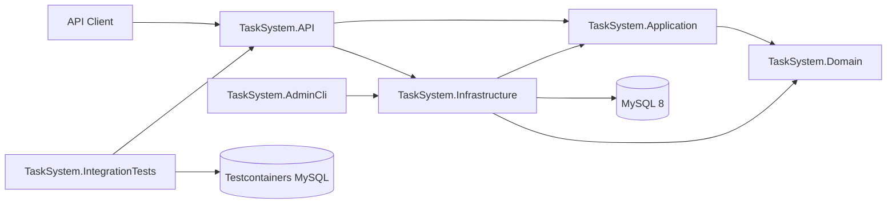

# TaskSystem

TaskSystem is a task management REST API built with ASP.NET Core and MySQL.

The project demonstrates layered backend architecture, JWT authentication, refresh token rotation, role-based authorization, user-scoped resource access, background processing, automated database migrations, Docker-based development, integration testing with real infrastructure, and continuous integration through GitHub Actions.

## Features

- User registration and login
- JWT bearer authentication
- Refresh token rotation
- Reused refresh token rejection
- Role-based authorization with `onboarding`, `user`, and `admin` roles
- User onboarding and profile creation
- User-scoped task management
- Administrative user and task management
- Admin promotion tokens
- Separate administrative CLI
- FluentValidation request validation
- Mapster object mapping
- Global validation and exception middleware
- Background cleanup of expired tokens
- MySQL persistence through Entity Framework Core
- Swagger/OpenAPI documentation with JWT support
- Database health checks
- Unit and integration tests
- Docker Compose environment
- GitHub Actions CI pipeline

## Technology Stack

| Area                | Technologies                                       |
| ------------------- | -------------------------------------------------- |
| Backend             | C#, .NET 10, ASP.NET Core Web API                  |
| Data access         | Entity Framework Core 9, Pomelo MySQL provider     |
| Database            | MySQL 8                                            |
| Authentication      | JWT bearer authentication, refresh token rotation  |
| Authorization       | Role-based and resource-based authorization        |
| Validation          | FluentValidation                                   |
| Mapping             | Mapster                                            |
| API documentation   | Swagger / OpenAPI                                  |
| Unit testing        | xUnit, Moq, EF Core InMemory                       |
| Integration testing | xUnit, WebApplicationFactory, Testcontainers       |
| Infrastructure      | Docker, Docker Compose, ASP.NET Core Health Checks |
| CI                  | GitHub Actions                                     |

## Architecture

The solution separates HTTP concerns, application use cases, domain models, and infrastructure implementations.



### Projects

- `TaskSystem.API`
  Controllers, authentication, authorization, Swagger, middleware, health checks, dependency registration, and HTTP configuration.

- `TaskSystem.Application`
  Commands, queries, handlers, DTOs, validators, mapping configuration, and application-level abstractions.

- `TaskSystem.Domain`
  Domain entities, value objects, exceptions, and repository interfaces.

- `TaskSystem.Infrastructure`
  Entity Framework Core, repositories, migrations, JWT services, administrative services, and hosted background services.

- `TaskSystem.AdminCli`
  Command-line utility for administrative operations.

- `TaskSystem.Tests`
  Unit tests for application handlers and domain behavior.

- `TaskSystem.IntegrationTests`
  End-to-end API tests using `WebApplicationFactory` and a real MySQL 8 database started through Testcontainers.

## Authentication Flow

A newly registered account initially receives the `onboarding` role.

```text
Register
  ↓
onboarding access token
  ↓
Create user profile
  ↓
Role changed to user
  ↓
New access token issued
```

Authenticated users include their access token in the HTTP header:

```http
Authorization: Bearer ACCESS_TOKEN
```

Access tokens are short-lived. Refresh tokens are stored in the database and rotated whenever they are used.

When a refresh token is exchanged:

1. The old refresh token is revoked.
2. A new access token is issued.
3. A new refresh token is issued.
4. Reusing the old refresh token returns `401 Unauthorized`.

## Authorization Model

TaskSystem uses three roles:

| Role         | Purpose                                                  |
| ------------ | -------------------------------------------------------- |
| `onboarding` | Account has been created but profile setup is incomplete |
| `user`       | Standard authenticated application user                  |
| `admin`      | Administrative access to users and tasks                 |

Authorization is enforced at two levels:

- Role-based authorization restricts administrative endpoints.
- Resource ownership checks prevent users from accessing another user's tasks.

## API Overview

The complete endpoint list and request schemas are available through Swagger.

Main endpoint groups:

| Group                     | Purpose                                              |
| ------------------------- | ---------------------------------------------------- |
| `/api/auth`               | Registration, login, and refresh token operations    |
| `/api/user`               | Authenticated user onboarding and profile operations |
| `/api/user/uzduotys`      | User-scoped task operations                          |
| `/api/admin/users`        | Administrative user management                       |
| `/api/admin/uzduotys`     | Administrative task management                       |
| Admin promotion endpoints | Admin promotion token generation and redemption      |
| `/health`                 | Application and database health status               |

To call a protected endpoint through Swagger:

1. Register or log in.
2. Copy the returned access token.
3. Select **Authorize**.
4. Enter:

```text
Bearer ACCESS_TOKEN
```

## Testing

The solution currently contains 31 automated tests:

- 23 unit tests
- 8 integration tests

Run the complete test suite:

```bash
dotnet test TaskSystem.slnx
```

Docker must be running because the integration tests start a temporary MySQL container.

### Unit Tests

Unit tests use:

- xUnit
- Moq
- EF Core InMemory

They verify application handlers, validation behavior, repository interactions, authentication failures, refresh token persistence, user registration, and task operations.

Run only the unit tests:

```bash
dotnet test TaskSystem.Tests/TaskSystem.Tests.csproj
```

### Integration Tests

Integration tests use:

- `Microsoft.AspNetCore.Mvc.Testing`
- `WebApplicationFactory`
- Testcontainers
- Real MySQL 8
- Real ASP.NET Core middleware and controller pipeline

Covered scenarios include:

- Health endpoint returns `200 OK`
- Protected endpoint without a token returns `401 Unauthorized`
- Registration followed by login returns authentication tokens
- Authenticated user can access their profile
- Refresh token exchange rotates the token
- Reusing an old refresh token returns `401 Unauthorized`
- Normal user cannot access an admin endpoint
- User cannot access another user's task

Run only the integration tests:

```bash
dotnet test TaskSystem.IntegrationTests/TaskSystem.IntegrationTests.csproj
```

Testcontainers automatically creates and removes the temporary MySQL container.

## Continuous Integration

GitHub Actions runs on pushes and pull requests.

The CI pipeline performs:

1. Dependency restore
2. Release build
3. Unit and integration tests
4. EF Core pending model-change check
5. Docker Compose configuration validation
6. Docker image build
7. Full stack startup
8. API health smoke test
9. Container cleanup

The workflow uses MySQL 8 and Docker on the GitHub-hosted runner.

## Getting Started

### Prerequisites

Install:

- .NET 10 SDK
- Docker Desktop
- Git
- EF Core CLI tools for local migration commands

Clone the repository:

```bash
git clone https://github.com/AurimasG1/TaskSystem.git
cd TaskSystem
```

## Run with Docker Compose

Copy the environment template.

### PowerShell

```powershell
Copy-Item .env.example .env
```

### Bash

```bash
cp .env.example .env
```

Open `.env` and replace the example passwords and JWT signing key.

Start MySQL, apply database migrations, and launch the API:

```bash
docker compose up --build
```

The application will be available at:

- Swagger UI: `http://localhost:8080/swagger`
- Health check: `http://localhost:8080/health`

Stop the environment:

```bash
docker compose down
```

Stop the environment and remove the MySQL volume:

```bash
docker compose down -v
```

## Run Locally Without Docker

Start a MySQL 8 instance and create a database named `tasksystem`.

Restore dependencies:

```bash
dotnet restore TaskSystem.slnx
```

Configure local secrets from the repository root:

```bash
dotnet user-secrets set \
  "ConnectionStrings:DefaultConnection" \
  "server=localhost;port=3306;database=tasksystem;user=YOUR_USER;password=YOUR_PASSWORD" \
  --project TaskSystem.API
```

```bash
dotnet user-secrets set \
  "Jwt:Key" \
  "REPLACE_WITH_A_LONG_RANDOM_SECRET" \
  --project TaskSystem.API
```

```bash
dotnet user-secrets set \
  "Jwt:Issuer" \
  "TaskSystemAPI" \
  --project TaskSystem.API
```

Apply database migrations:

```bash
dotnet ef database update \
  --project TaskSystem.Infrastructure \
  --startup-project TaskSystem.API
```

Run the API:

```bash
dotnet run --project TaskSystem.API
```

Development endpoints:

- Swagger UI: `https://localhost:7214/swagger`
- Swagger UI: `http://localhost:5263/swagger`
- Health check: `http://localhost:5263/health`

## Configuration

The API uses standard ASP.NET Core configuration sources.

Required configuration values:

| Key                                   | Purpose                 |
| ------------------------------------- | ----------------------- |
| `ConnectionStrings:DefaultConnection` | MySQL connection string |
| `Jwt:Key`                             | JWT signing key         |
| `Jwt:Issuer`                          | Expected JWT issuer     |

Environment variable equivalents:

```text
ConnectionStrings__DefaultConnection
Jwt__Key
Jwt__Issuer
```

Sensitive values must not be committed to source control.

For local development, use .NET User Secrets. For Docker or deployment environments, use environment variables or a dedicated secrets manager.

## Admin CLI

The administrative CLI supports promoting users without exposing the operation through a public unrestricted endpoint.

Create:

```text
TaskSystem.AdminCli/.env
```

Add the database connection string:

```text
TASKSYSTEM_DB=server=localhost;port=3306;database=tasksystem;user=YOUR_USER;password=YOUR_PASSWORD
```

Promote a user by email:

```bash
dotnet run --project TaskSystem.AdminCli -- \
  admin promote \
  --email=user@example.com
```

Promote a user by ID:

```bash
dotnet run --project TaskSystem.AdminCli -- \
  admin promote \
  --userId=1
```

## Security Considerations

- Protected endpoints require a valid JWT access token.
- Admin endpoints require the `admin` role.
- User task operations verify resource ownership.
- Refresh tokens are rotated and revoked after use.
- Expired tokens are removed by a hosted background service.
- Passwords are stored as hashes.
- Secrets are supplied through User Secrets or environment variables.
- Real credentials must not be committed to the repository.

## Planned Improvements

- Structured logging with Serilog
- Rate limiting for authentication endpoints
- Access and refresh token cookie support for browser clients
- Pagination and filtering for administrative queries
- Additional integration tests for validation and failure scenarios
- API usage examples with request and response payloads
- Deployment configuration for a cloud environment
- Code coverage reporting in CI

## Author

**Aurimas Gedvilas**

- GitHub: `AurimasG1`
- LinkedIn: `aurimas-gedvilas`
