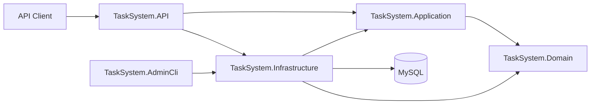

# TaskSystem

TaskSystem is a task management REST API built with ASP.NET Core. It demonstrates layered application design, JWT-based authentication, refresh token rotation, role-based authorization, validation, object mapping, background processing, automated database migrations, and containerized local development.

## Key Features

- User registration, login, and JWT authentication
- Refresh token rotation
- Role-based authorization with `onboarding`, `user`, and `admin` roles
- User onboarding and profile management
- User-scoped task creation, retrieval, update, deletion, and latest-task operations
- Administrative user and task management
- Admin promotion tokens
- Separate administrative CLI
- FluentValidation request validation
- Mapster object mapping
- Global exception and validation middleware
- Background cleanup of expired tokens
- MySQL persistence through Entity Framework Core
- Swagger/OpenAPI documentation with JWT support
- Health check endpoint
- Unit tests with xUnit, Moq, and EF Core InMemory
- Docker Compose environment for the API, migrations, and MySQL

## Technology Stack

| Area | Technologies |
|---|---|
| Backend | C#, .NET 10, ASP.NET Core Web API |
| Data access | Entity Framework Core 9, Pomelo MySQL provider |
| Database | MySQL 8 |
| Authentication | JWT bearer authentication, refresh token rotation |
| Validation and mapping | FluentValidation, Mapster |
| API documentation | Swagger / OpenAPI |
| Testing | xUnit, Moq, EF Core InMemory |
| Infrastructure | Docker, Docker Compose, ASP.NET Core Health Checks |

## Architecture

The solution separates HTTP concerns, application use cases, domain models, and infrastructure implementations.



### Projects

- **TaskSystem.API** — controllers, authentication, authorization, Swagger, middleware, dependency registration, and HTTP configuration.
- **TaskSystem.Application** — commands, queries, handlers, DTOs, validation, mapping, and application-level abstractions.
- **TaskSystem.Domain** — domain entities and interfaces.
- **TaskSystem.Infrastructure** — Entity Framework Core, repositories, migrations, authentication services, admin services, and background services.
- **TaskSystem.AdminCli** — command-line utility for administrative operations.
- **TaskSystem.Tests** — unit tests for application and domain behavior.

## Security Model

- Access to protected endpoints requires a valid JWT access token.
- Authorization rules are enforced through the `onboarding`, `user`, and `admin` roles.
- User operations are restricted to the authenticated user's resources.
- Refresh tokens are rotated instead of being reused indefinitely.
- Expired tokens are removed by a hosted background service.
- Local secrets are stored through .NET User Secrets.
- Container secrets are supplied through environment variables.
- Real credentials must not be committed to source control.

## Getting Started

### Prerequisites

Install:

- .NET 10 SDK
- Docker Desktop, or a local MySQL 8 server
- Entity Framework Core CLI tools for local migration commands

Clone the repository:

```bash
git clone https://github.com/AurimasG1/TaskSystem.git
cd TaskSystem
```

## Run with Docker Compose

Copy the environment template:

### PowerShell

```powershell
Copy-Item .env.example .env
```

### Bash

```bash
cp .env.example .env
```

Open `.env` and replace the example passwords and JWT key.

Start MySQL, run the database migrations, and launch the API:

```bash
docker compose up --build
```

The API will be available at:

- Swagger UI: `http://localhost:8080/swagger`
- Health check: `http://localhost:8080/health`

Stop the environment:

```bash
docker compose down
```

Remove the database volume as well:

```bash
docker compose down -v
```

## Run Locally Without Docker

Start a MySQL 8 instance and create the `tasksystem` database.

Restore dependencies:

```bash
dotnet restore
```

Configure local secrets from the repository root:

```bash
dotnet user-secrets set "ConnectionStrings:DefaultConnection" "server=localhost;port=3306;database=tasksystem;user=YOUR_USER;password=YOUR_PASSWORD" --project TaskSystem.API
dotnet user-secrets set "Jwt:Key" "REPLACE_WITH_A_LONG_RANDOM_SECRET" --project TaskSystem.API
dotnet user-secrets set "Jwt:Issuer" "TaskSystemAPI" --project TaskSystem.API
```

Apply database migrations:

```bash
dotnet ef database update --project TaskSystem.Infrastructure --startup-project TaskSystem.API
```

Run the API:

```bash
dotnet run --project TaskSystem.API
```

Development URLs:

- Swagger UI: `https://localhost:7214/swagger`
- Swagger UI: `http://localhost:5263/swagger`
- Health check: `http://localhost:5263/health`

## API Overview

The complete and current endpoint list is available through Swagger.

Main endpoint groups:

| Group | Purpose |
|---|---|
| `/api/auth` | Registration, login, and refresh token operations |
| `/api/user` | Authenticated user onboarding and profile operations |
| `/api/user/uzduotys` | User task operations |
| `/api/admin/users` | Administrative user management |
| `/api/admin/uzduotys` | Administrative task management |
| Admin promotion endpoints | Promotion token generation and redemption |

To call protected endpoints in Swagger:

1. Register or log in.
2. Copy the returned access token.
3. Select **Authorize**.
4. Enter the token as `Bearer YOUR_ACCESS_TOKEN`.

## Run Tests

Run the complete test suite:

```bash
dotnet test
```

The test project uses:

- xUnit
- Moq
- EF Core InMemory
- Coverlet collector

## Admin CLI

Create `TaskSystem.AdminCli/.env`:

```env
TASKSYSTEM_DB=server=localhost;port=3306;database=tasksystem;user=YOUR_USER;password=YOUR_PASSWORD
```

Promote a user by email:

```bash
dotnet run --project TaskSystem.AdminCli -- admin promote --email=user@example.com
```

Promote a user by ID:

```bash
dotnet run --project TaskSystem.AdminCli -- admin promote --userId=1
```

## Configuration

The API reads configuration from standard ASP.NET Core configuration sources.

Required values:

| Key | Purpose |
|---|---|
| `ConnectionStrings:DefaultConnection` | MySQL connection string |
| `Jwt:Key` | JWT signing key |
| `Jwt:Issuer` | Expected JWT issuer |

Environment variable equivalents:

```text
ConnectionStrings__DefaultConnection
Jwt__Key
Jwt__Issuer
```

## Planned Improvements

- Structured logging with Serilog
- API integration tests
- GitHub Actions build and test workflow
- Additional API documentation and usage examples

## Author

**Aurimas Gedvilas**

- GitHub: [AurimasG1](https://github.com/AurimasG1)
- LinkedIn: [aurimas-gedvilas](https://www.linkedin.com/in/aurimas-gedvilas/)
